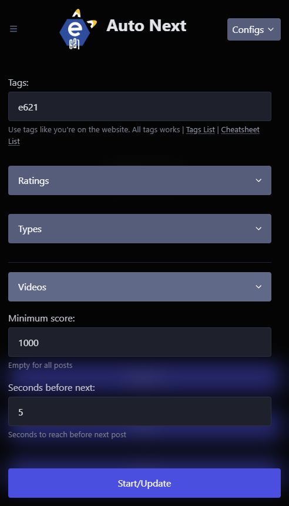

# E6 Auto Next
Simple software to automatically switch to the following posts for use in hands free.

# Why ?
Imagine, you are playing solo and you lack a little imagination. You then go to your favorite site via your phone or your PC to get inspired. You then spend a pleasant moment in front of your favorite video, but woe! Your video is finished... You would like to move on to another one, but you are a little too busy and your hands slip a little too much. In addition, you do not want to dirty your equipment! Next time, you will install "E6 Auto Next": you will prepare your search in advance and you will let it do its job! And presto, no more gaming sessions with a dirty phone or PC!

# Features
- e621.net and e6ai.net compatible
- Save multiple configurations
- Searching your tags
- Filtering by rating (safe, questionnable, explicit)
- Filtering by media types (image, animated, videos)
- Adjust your video settings to wait the end before next, mute or show controls
- Pause at anytime (if you want more time to look)
- Filtering by minimum score

# Requirements
- Compatible linux, macos, windows
- An account on e621.net or e6ai.net
- A pc to run

# Installation
Just download the setup on [releases](https://github.com/thefufux/e6AutoNext/releases) and run it !
Then, go to http://localhost/ on a browser or type the local IP of the PC where the server run.

# Contributions
 |||
 |-|-|
 | NodeJS | For environnment |
 | ExpressJs | For server side |
 | PicoCSS | For front-end |
 | Pkg | For distribute |

 The project is open to all pull requests.